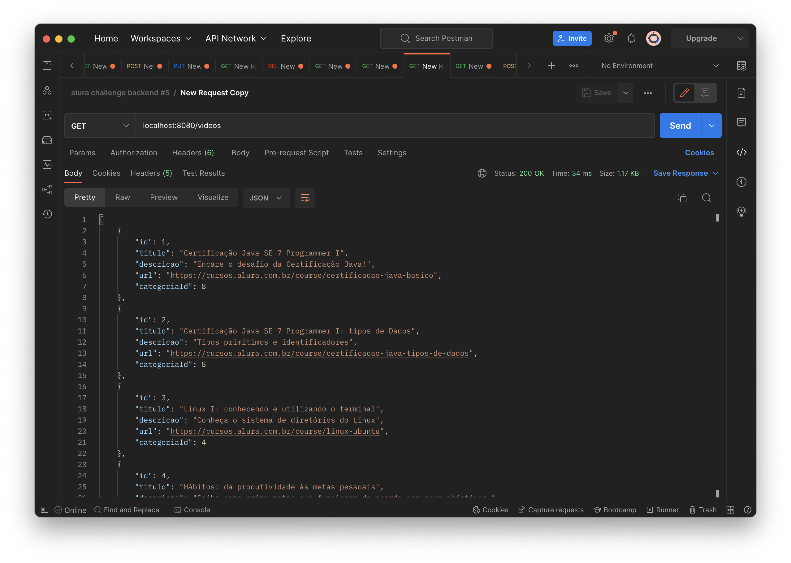

# ALURA CHALLENGE BACKEND #5

## 🚧 Em Desenvolvimento 🚧
API REST desenvolvida durante o challenge #05 de backend da Alura.

Esta API implementa as seguintes especificações:
1. Rotas no padrão REST com serviço de autenticação.
2. Validações feitas conforme as regras de negócio.
3. Base de dados para persistência das informações.
4. Serviço de autenticação Stateless com JWT para acesso às rotas GET, POST, PUT e DELETE.
5. Paginação das requisições.

## Regras de Negócio:
1. Todos os campos de vídeos e categorias devem ser obrigatórios e validados.
2. A categoria com ID = 1, deve chamar LIVRE e caso ela não seja especificada na criação do vídeo, será atribuído o ID = 1.
3. Endpoint "GET /videos/free" com um número fixo de filmes disponível, sem a necessidade de autenticação.

## Rotas CRUD:

<table>
    <tr>
        <th>Method</th>
        <th>Route</th>
        <th>Description</th>
        <th>Body Param.</th>
        <th>Query Param.</th>
        <th>Necessário Autenticação</th>
    </tr>
    <tr>
        <td>POST</td>
        <td>/login</td>
        <td>Autentica e retorna o token JWT</td>
        <td>{"username","password"}</td>
        <td>-</td>
        <td>Não</td>
    </tr>
    <tr>
        <td>GET</td>
        <td>/videos/free</td>
        <td>Retorna videos livres</td>
        <td>-</td>
        <td>-</td>
        <td>Não</td>
    </tr>
    <tr>
        <td>GET</td>
        <td>/videos</td>
        <td>Retorna todos os vídeos</td>
        <td>-</td>
        <td>-</td>
        <td>Sim [USER]</td>
    </tr>
    <tr>
        <td>GET</td>
        <td>/videos/{id}</td>
        <td>Retorna video pelo id</td>
        <td>-</td>
        <td>video id</td>
        <td>Sim [USER]</td>
    </tr>
    <tr>
        <td>GET</td>
        <td>/videos/?search={nome}</td>
        <td>Buscar um vídeo pelo nome</td>
        <td>-</td>
        <td>nome a ser buscado</td>
        <td>Sim [USER]</td>
    </tr>
    <tr>
        <td>DELETE</td>
        <td>/videos/{id}</td>
        <td>Deleta video pelo id</td>
        <td>-</td>
        <td>video id</td>
        <td>Sim [ADMIN]</td>
    </tr>
    <tr>
        <td>POST</td>
        <td>/videos</td>
        <td>Cria um novo vídeo</td>
        <td>{"titulo","descricao","url","categoriaId"}</td>
        <td>-</td>
        <td>Sim [USER]</td>
    </tr>
    <tr>
        <td>PUT</td>
        <td>/videos/{id}</td>
        <td>Atualizar video</td>
        <td>{"titulo","descricao","url","categoriaId"}</td>
        <td>video id</td>
        <td>Sim [ADMIN]</td>
    </tr>
    <tr>
        <td>GET</td>
        <td>/categorias</td>
        <td>Retorna todas as categorias</td>
        <td>-</td>
        <td>-</td>
        <td>Sim [USER]</td>
    </tr>
    <tr>
        <td>GET</td>
        <td>/categorias/{id}</td>
        <td>Retorna categoria pelo id</td>
        <td>-</td>
        <td>categoria id</td>
        <td>Sim [USER]</td>
    </tr>
    <tr>
        <td>GET</td>
        <td>/categorias/{id}/videos</td>
        <td>Retorna todos os videos pertencentes a uma categoria</td>
        <td>-</td>
        <td>categoria id</td>
        <td>Sim [USER]</td>
    </tr>
    <tr>
        <td>DELETE</td>
        <td>/categorias/{id}</td>
        <td>Deleta categoria pelo id</td>
        <td>-</td>
        <td>categoria id</td>
        <td>Sim [ADMIN]</td>
    </tr>
    <tr>
        <td>POST</td>
        <td>/categorias</td>
        <td>Cria uma nova categoria</td>
        <td>{"titulo","cor"}</td>
        <td>-</td>
        <td>Sim [USER]</td>
    </tr>
    <tr>
        <td>PUT</td>
        <td>/categorias/{id}</td>
        <td>Atualizar categoria</td>
        <td>{"titulo","cor"}</td>
        <td>categoria id</td>
        <td>Sim [ADMIN]</td>
    </tr>
</table>

## Deploy:
Foi feito o Deploy da aplicação como um serviço Web na nuvem, utilizando a plataforma Amazon AWS.

## Stack:
- `Linguagem Java`
- `Framework Spring Boot`
- `Maven`
- `Banco de Dados MySQL`
- `JJWT - Java Json Web Token`
- `JUnit`
- `Amazon AWS`

## Pendentes Semana 1:
- [X] Testes para verificar Status code das requisições GET, POST, PUT e DELETE.

## Pendentes Semana 2:
- [X] Adicionar categorias e seus campos na base de dados.
- [X] Rotas CRUD para /categorias.
- [X] Incluir campo categoriaId no modelo video.
- [X] Escrever os testes necessários.

## Pendentes Semana 3:
- [X] Implementar uma rota para videos livres sem autenticação.
- [X] Implementar um mecanismo de autenticação na API.
- [X] Reimplementar os testes com base em autenticação.
- [X] Realizar o deploy da API em algum provedor Cloud.